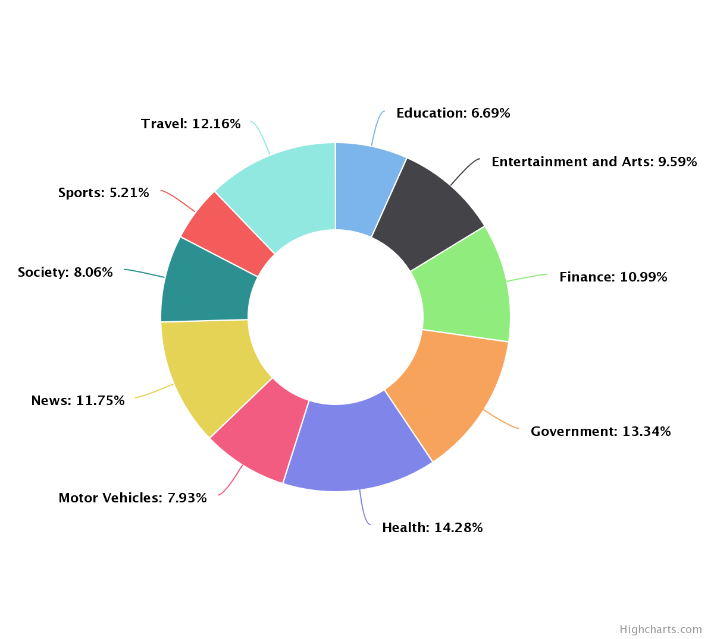
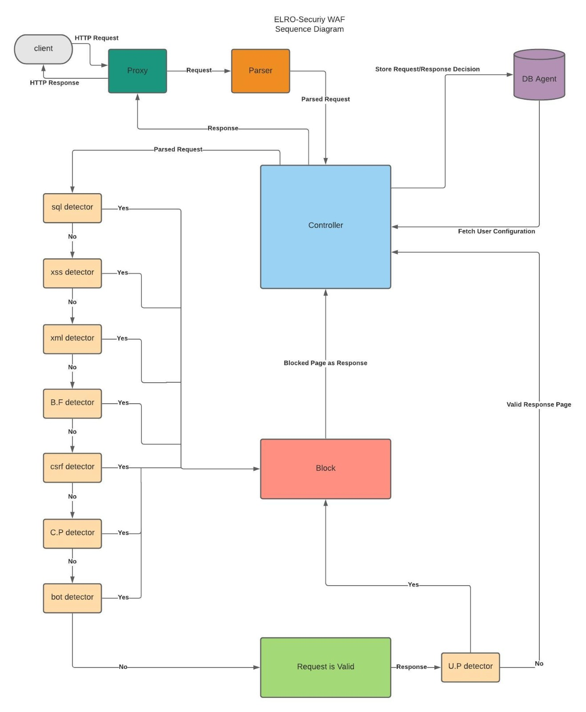

# ELRO-Security (WAF)     
ELRO-Security is an advance & free WAF (Web Application Firewall), 
It is using to defend servers and especially websites around the internet. 
It is very easy to install and allow websites owner to add their own website 
via a web application interface which makes it accessible for almost everyone regardless of the level of codding.

### Background
When we visit a website, there are some concerns about the reliability of the website,
In fact, we are exposed to a several number of vulnerabilities that we are not aware of.

In addition to that the server side may be exposed as well to some vulnerabilities, 
such as SQL injections, Brute Force, XSS attacks, etc.
Resulting in a situation where all the website clients are now at a potential risk to future attacks and leakage of private information.

In our world, the web privacy and security are a very important matter, and it seems that not all the web developers are aware of the consequences of unsecured development,
And even worse there are cases where the developers think that their code is as secured as possible, and not aware that they are using unsecured functions, for example using scanf instead of scanf_s.

In fact, on average 30,000 new websites are hacked every day. For example, SQL Injection Attacks: So Old, but Still So Relevant. Here’s Why

**The Goal:** Increase the web privacy and security among clients and service providers, that cannot afford highly expensive products, and are still aware of the risks online. We would like to prevent common server and client attacks.

### Our tool coverage 
* SQL Injection: Detecting & preventing SQL injection attacks [configurable, option].
* XSS Injection: Detecting & preventing XSS injections attacks [configurable, option].
* XML Injection: Detecting & preventing XML injections attacks [configurable, option].
* Brute Force: Detecting & preventing brute force attacks [configurable, option].
* CSRF: Detecting & preventing CSRF attacks [configurable, option].
* User Protector:   Detecting attempts to attack the user & protecting the user from server attacks [configurable, option].
* Bots: Detecting & preventing bots to communicate with your server [configurable, option].
* Proxy Detector: Detecting requests that arriving via proxy [configurable, option].
* HTTPS Enforcer: Will enforce the user to use https.

### Work flow

### Requirements
* Python3 (tested on 3.7).
* Python modules as specified on requirements.txt.
* Postgres Database
* Linux server
* Legit Certificate (HTTPS)

### API

### Entry-Point
For the **API** is wsgi_api.py

For the **WAF** (The proxy) is wsgi.py

### Default configurations
Can be changed at Knowledge_Base, each detector has its own config file (should be a JSON format). 
You can find more details inside every config file.
At the config.py tou will find the necessary configuration for get you started.

### Further Attacks
Of course, you can clone & implement other exploits. Our interface is generic and supports several exploiting methods.

### Automation
WP-Exploiter has the potential to be automated in different ways. We are going to leave this to you. 
You can find an example at examples/run.py.

### Note
* We do not claim the description or the purpose of this tool to be 100% accurate. If you see anything which is incorrect in this document, please submit a pull request or open a new issue.
* We are not responsible for any usage of anyone on this tool.
